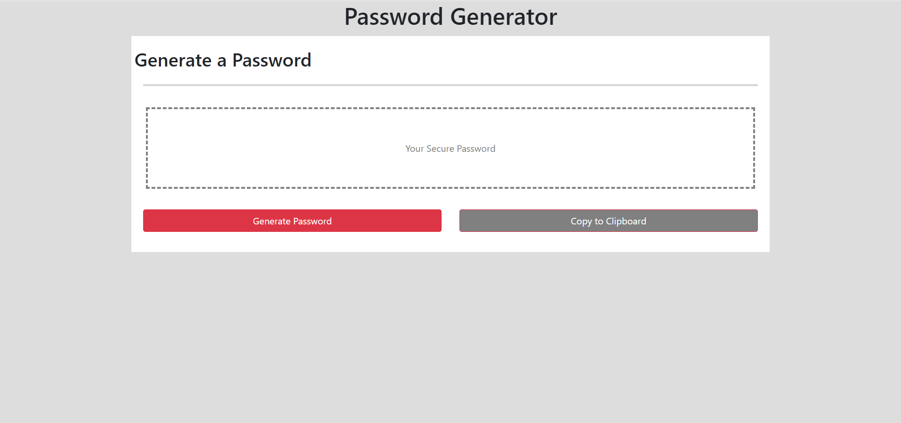

# Homework 2 - Password Generator

This repo is for the UNCC coding bootcamp's third homework assignment

## Instructions

Create a webpage that can generate a password with a length specified by the user, as well as allow the user to select the makeup of said password

As a bonus; To create a working "Copy to Clipboard" button that directly copy's the generated password to user's clipboard

## Screenshot

   

### Links

[Github Repo](https://github.com/Goldpm/HW3-Password-Generator)

[Completed Work](https://goldpm.github.io/HW3-Password-Generator/)
